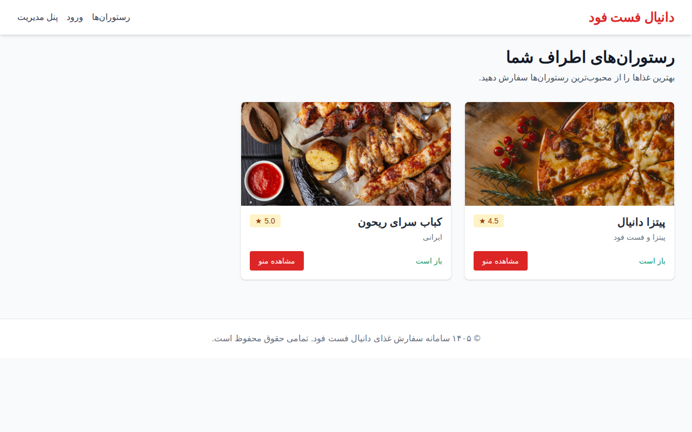
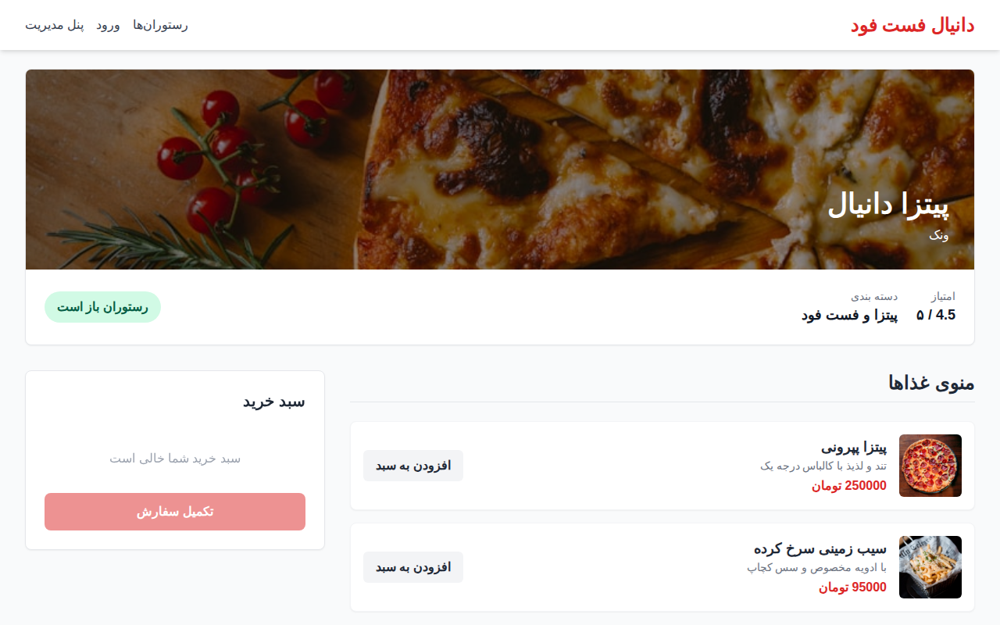
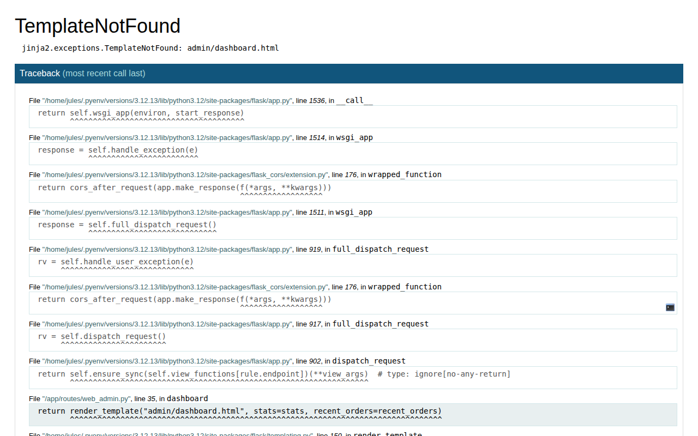
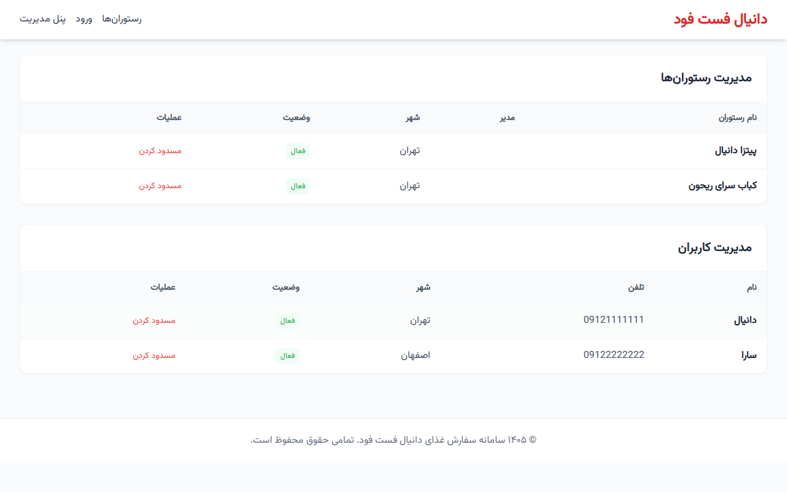

# سامانه سفارش غذای دانیال فست فود

این پروژه یک پلتفرم جامع سفارش آنلاین غذا مشابه تپسی‌فود است که با استفاده از Python و Flask توسعه یافته است.

## قابلیت‌های جدید و کلیدی

- **بازنویسی کامل ساختار:** استفاده از Blueprint برای مدیریت بهینه کدها و افزایش خوانایی.
- **سیستم لوکیشن:** ذخیره‌سازی مختصات جغرافیایی (Latitude/Longitude) برای کاربران و رستوران‌ها.
- **امتیازدهی و نظرات:** امکان ثبت نظر و امتیاز ۱ تا ۵ و محاسبه خودکار میانگین امتیاز رستوران.
- **پنل مدیریت کل:** داشبورد پیشرفته برای مشاهده آمار فروش، مدیریت کاربران و تایید رستوران‌ها.
- **رابط کاربری وب:** طراحی مدرن و ریسپانسیو با استفاده از Tailwind CSS (به صورت کاملاً محلی).
- **سازگاری با موبایل:** حفظ تمامی Endpointهای قبلی جهت جلوگیری از بروز مشکل در اپلیکیشن موبایل فعلی.

## تصاویر محیط برنامه (Web UI)

### صفحه اصلی وب‌سایت


### منوی رستوران و نظرات


### داشبورد مدیریت


### مدیریت کاربران و رستوران‌ها



## راهنمای نصب و راه‌اندازی

۱. **ایجاد محیط مجازی و نصب وابستگی‌ها:**
```bash
python3 -m venv venv
source venv/bin/activate
pip install -r requirements.txt
```

۲. **آماده‌سازی دیتابیس (Seeding):**
برای پر کردن دیتابیس با داده‌های فرضی کامل (ادمین، کاربران، رستوران‌ها، غذاها و نظرات) دستور زیر را اجرا کنید:
```bash
python3 seed.py
```

۳. **اجرای سرور:**
```bash
python3 app.py
```
پس از اجرا، سامانه در آدرس `http://127.0.0.1:5000` در دسترس خواهد بود.

## اطلاعات ورود پیش‌فرض (تولید شده توسط Seed)
### پنل مدیریت کل (`/admin/login`):
- **نام کاربری:** `admin`
- **رمز عبور:** `admin123`

### کاربر وب (`/login`):
- **شماره تلفن:** `09121111111`
- **رمز عبور:** `user123`
